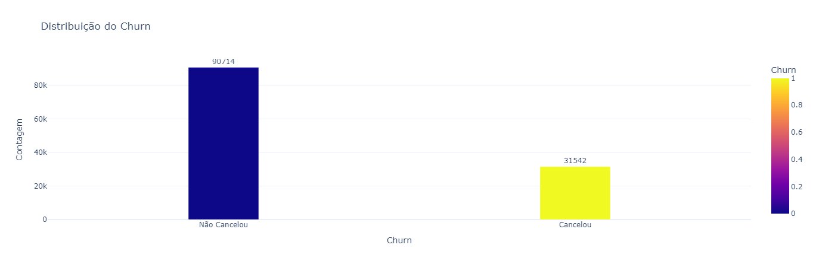
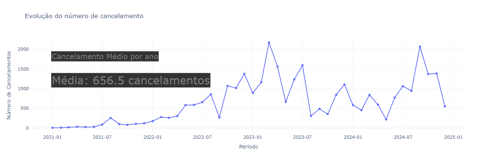
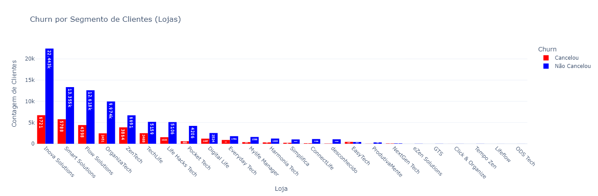
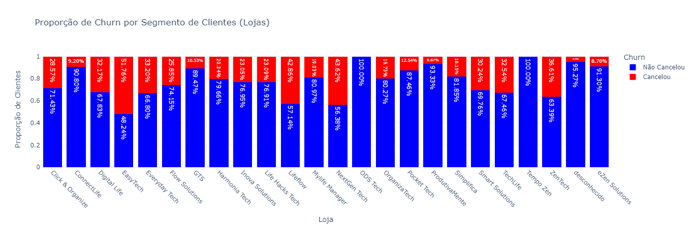
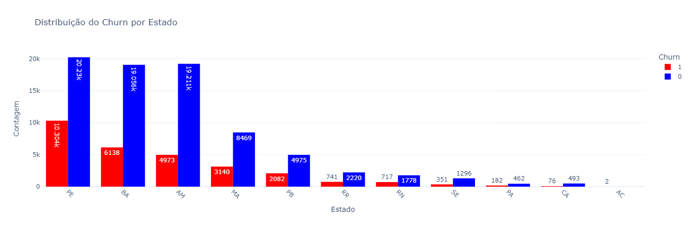
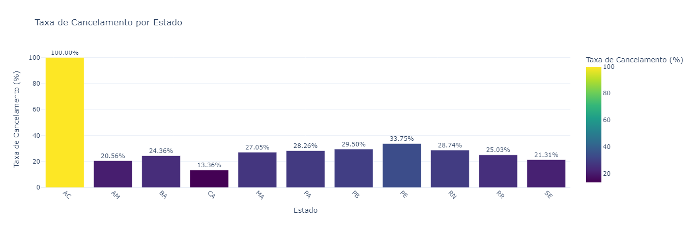
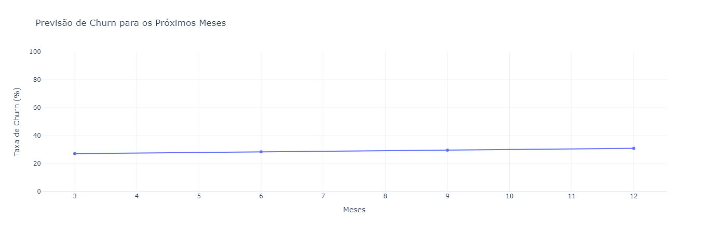

```{r, echo=F, eval=T, results='markup', fig.width=8, fig.height=4, fig.align='center', out.width="1\\linewidth", warning=FALSE, message=FALSE, size='tiny'}

## Pacotes -------------

## Pacotes ----

library(tidyverse)
library(lubridate)
library(tstools)
library(sidrar)
library(zoo)
library(scales)
library(gridExtra)
library(timetk)
library(knitr)
library(Quandl)
library(knitr)
library(ggthemes)
library(rbcb)
library(kableExtra)
library(sidrar)


# Acumular  valores percentuais em 'n' janelas móveis
acum_i <- function(data, n){
  
  data_ma_n <- RcppRoll::roll_meanr(data, n)
  
  data_lag_n <- dplyr::lag(data_ma_n, n)
  
  data_acum_n = (((data_ma_n/data_lag_n)-1)*100)
  
  return(data_acum_n)
  
}
colours <- c("#428953", "#CE2929", "#A3DD57", "#77E599","#5774dd", "#c0c4d1", "#d0d1c0", "#50c76d")


```


::: {.grid}

::: {.g-col-9}


## Introdução 

O estudo teve como foco atender aos seguintes objetivos estratégicos:

- Identificar os principais motivos do churn: Determinar os fatores que levam os clientes a cancelar seus contratos.

- Segmentar os clientes com base no risco de churn: Criar categorias de clientes de acordo com sua propensão ao churn.

- Propor estratégias eficazes para reduzir o churn: Recomendar ações práticas e orientadas por dados para melhorar a retenção de clientes.

::: {.callout-note}
 
**Interaja clicando nas tabelas e gráficos, para visualizar os resultado**

:::

:::


::: {.g-col-9}

# Metodologia 

O estudo teve como foco atender aos seguintes objetivos estratégicos:

- Identificar os principais motivos do churn: Determinar os fatores que levam os clientes a cancelar seus contratos.

- Segmentar os clientes com base no risco de churn: Criar categorias de clientes de acordo com sua propensão ao churn.

- Propor estratégias eficazes para reduzir o churn: Recomendar ações práticas e orientadas por dados para melhorar a retenção de clientes.

### Tratamento dos Dados

- O objetivo desta etapa foi garantir a consistência e a qualidade do dataset, tratando valores ausentes, eliminando inconsistências e ajustando os dados para análises exploratórias e modelagem preditiva.

- O dataset utilizado, intitulado Base de Contratos.xlsx, contém 122.256 registros e 16 colunas, abrangendo informações de clientes, contratos, renovações, cancelamentos e engajamento com o aplicativo. Durante a inspeção inicial, foram identificados valores ausentes em várias colunas, como estado, consultor, e *data_do_pagamento*. Algumas inconsistências também foram encontradas, como valores irreais nas variáveis de duração de contratos

#### Carregamento Inicial 

- O dataset inicial possuía 122.256 registros e 16 colunas com informações de clientes, contratos, renovações, cancelamentos e engajamento com o aplicativo.
Durante a inspeção inicial, foram identificados valores ausentes em diversas colunas, como estado (15.103 valores ausentes), consultor (98.446 valores ausentes), e data_do_pagamento (104.137 valores ausentes). Além disso, foram detectados valores inconsistentes em variáveis de duração de contratos e outros registros.

#### Tratamento de Valores Ausentes

- *Variáveis Categóricas:* Foram preenchidas com valores que representassem adequadamente a ausência de informações:
filial_de_contratacao e estado: Substituídos por 'desconhecido'.
consultor: Preenchido com 'nao_informado'.
disponibilidade_do_servico: Substituído por 'nao_disponivel'.

- *Variáveis Numéricas e Temporais:* Ajustadas conforme o contexto:
data_do_pagamento e data_de_cancelamento foram utilizadas para criar variáveis indicadoras de status (e.g., pagamentos realizados ou cancelamentos).


#### Criação de Novas Variáveis

Com base nos ajustes realizados, foram criadas variáveis adicionais para facilitar a análise e modelagem:

- Churn: Indicador binário que identifica se o cliente cancelou o contrato.

- Engajamento: Variável que representa se o cliente acessou ou não o aplicativo durante a vigência do contrato.

- Pagamentos: Variável que indica se houve registro de pagamento


#### Resultado Final

Após o tratamento, o dataset final apresenta as seguintes características: 

- Tamanho: 122.256 registros e 16 colunas.

- Principais Ajustes Realizados:
 - Valores ausentes tratados e inconsistências corrigidas 
 - Variáveis categóricas padronizadas
 - Novas variáveis criadas para análise e modelagem preditiv


## Análise Exploratória

- A análise exploratória teve como finalidade identificar padrões, tendências e relações nos dados que possam ajudar a explicar o comportamento de churn dos clientes. Essa etapa também serviu para selecionar variáveis relevantes para a modelagem preditiva e identificar possíveis melhorias para o negócio.


### Informações Retiradas 

- Aproximadamente 25\% dos clientes cancelaram seus contratos, enquanto 74\% permaneceram ativos, totalizando 90.714 clientes que não cancelaram. Essa proporção indica que, embora a maior parte dos clientes tenha sido retida, a taxa de churn é significativa e requer ações imediatas.

- O número de cancelamentos apresentou uma tendência crescente a partir de 2022, com um pico significativo em março de 2023, quando 2.173 contratos foram cancelados. O número de cancelamentos continuou a crescer, atingindo seu valor máximo em 2024. A média mensal de cancelamentos foi de 656 contratos. Esses números demonstram que o churn é um problema em expansão, impactando diretamente a receita da empresa.


Entre os clientes que cancelaram seus contratos, os principais motivos registrados foram:

- Falta de contato: Representou 40% dos cancelamentos, destacando a importância de um acompanhamento mais próximo dos clientes.

- Desinteresse pelo serviço: Correspondeu a 34% dos cancelamentos, indicando a necessidade de melhorar a proposta de valor percebida pelos clientes.

*Principais Insights* 

- Proporção de Retenção: Apesar de 74% dos clientes ainda estarem ativos, o aumento contínuo no churn ameaça a sustentabilidade do negócio.

- Tendências Temporais: O crescimento do churn, especialmente após 2022, reforça a urgência em implementar estratégias de retenção mais eficazes.
Motivos Críticos:

- A falta de contato com os clientes é o principal fator de churn, sugerindo oportunidades para melhorias nos processos de comunicação e acompanhamento.
O desinteresse pelo serviço reflete a necessidade de ajustar os serviços oferecidos para atender melhor às expectativas dos clientes.

::: {.callout-note}
 
**Interaja clicando, para visualizar os resultado**

:::

### Proporção e resultado ao longo do tempo 

::: panel-tabset

#### Proporção de churn

```{r, echo=F, eval=T, results='markup', fig.width=8, fig.height=4, fig.align='center', out.width="1\\linewidth", warning=FALSE, message=FALSE, size='tiny'}


```


#### Distribuição

```{r, echo=F, eval=T, results='markup', fig.width=8, fig.height=4, fig.align='center', out.width="1\\linewidth", warning=FALSE, message=FALSE, size='tiny'}




```

#### Evolução 

```{r, echo=F, eval=T, results='markup', fig.width=8, fig.height=4, fig.align='center', out.width="1\\linewidth", warning=FALSE, message=FALSE, size='tiny'}




```

:::

### Resultado por Loja

::: panel-tabset

#### Cancelamento por loja

```{r, echo=F, eval=T, results='markup', fig.width=8, fig.height=4, fig.align='center', out.width="1\\linewidth", warning=FALSE, message=FALSE, size='tiny'}




```


#### Motivos de cancelamento

```{r, echo=F, eval=T, results='markup', fig.width=8, fig.height=4, fig.align='center', out.width="1\\linewidth", warning=FALSE, message=FALSE, size='tiny'}


```

#### Proporção

```{r, echo=F, eval=T, results='markup', fig.width=8, fig.height=4, fig.align='center', out.width="1\\linewidth", warning=FALSE, message=FALSE, size='tiny'}




```


:::

### Resultado por Estado

::: panel-tabset

#### Cancelamento por estado

```{r, echo=F, eval=T, results='markup', fig.width=8, fig.height=4, fig.align='center', out.width="1\\linewidth", warning=FALSE, message=FALSE, size='tiny'}




```


#### Taxa de cancelamento por estado

```{r, echo=F, eval=T, results='markup', fig.width=8, fig.height=4, fig.align='center', out.width="1\\linewidth", warning=FALSE, message=FALSE, size='tiny'}




```


:::


## Modelo Preditivo

- O objetivo da modelagem preditiva foi identificar os clientes com maior probabilidade de churn nos próximos meses, permitindo que a empresa implemente ações proativas para reduzir o número de cancelamentos.

#### Etapas da Modelagem

- As variáveis preditoras foram selecionadas considerando aspectos como duração do contrato, engajamento com o aplicativo, disponibilidade do serviço, e histórico de pagamentos.
Os dados foram tratados para corrigir valores ausentes, escalonados para padronização, e variáveis categóricas foram codificadas usando One-Hot Encoding.

- O dataset foi balanceado com a técnica SMOTE, resultando em uma distribuição equilibrada entre as classes (churn = 1 e churn = 0), com 50\% para cada

#### Modelo Preditivo 

- A Regressão Logística foi utilizada como o modelo preditivo, devido à sua simplicidade, interpretabilidade e bom desempenho em problemas binários como o churn.

- O modelo Logit (ou Regressão Logística) é um método estatístico amplamente utilizado para problemas de classificação binária, onde o objetivo é prever a probabilidade de um evento ocorrer ou não. Ele modela a relação entre uma variável dependente binária (neste caso, churn, que assume os valores 1 ou 0) e uma ou mais variáveis independentes (features ou preditores).

O Logit usa a seguinte fórmula para estimar probabilidades:

$$
\hat{y} = \frac{1}{1 + e^{-(\beta_0 + \beta_1x_1 + \beta_2x_2 + \dots + \beta_nx_n)}}
$$
\begin{itemize}
    \item $\hat{y}$: é a probabilidade prevista de churn (ou qualquer evento de interesse).
    \item $\beta_0$: é o intercepto do modelo.
    \item $\beta_1, \beta_2, \dots, \beta_n$: são os coeficientes que representam o impacto das variáveis $x_1, x_2, \dots, x_n$ na probabilidade de churn.
    \item $x_1, x_2, \dots, x_n$: são as variáveis preditoras.
\end{itemize}


#### Resultados do Modelo

- O dataset foi dividido em treino (70%) e teste (30%).
- O modelo foi treinado no conjunto balanceado e avaliado com métricas padrão da área:
- AUC-ROC: 0,95 (excelente separação entre churn e não churn).
- Precisão: 86%.
- F1-Score: 88%.
- RMSE (Erro Quadrático Médio): 0,29.

- O modelo alcançou uma acurácia geral de 88\%, demonstrando alta capacidade preditiva.
A matriz de confusão indicou uma boa identificação tanto de clientes propensos ao churn quanto dos que permaneceram.


## Previsão fora da amostra 

O modelo foi aplicado para prever a taxa de churn cumulativa em períodos futuros de 3, 6, 9 e 12 meses, considerando uma taxa inicial de churn de 25,8\%.


| **Período (Meses)** | **Taxa de Churn Prevista (%)** |
|----------------------|-------------------------------|
| 3                   | 27,09                         |
| 6                   | 28,38                         |
| 9                   | 29,67                         |
| 12                  | 30,96                         |
|----------------------|-------------------------------|


O aumento gradual na taxa de churn reforça a necessidade de ações preventivas para conter a escalada de cancelamentos.

### Previsão fora da amostra 

```{r, echo=F, eval=T, results='markup', fig.width=8, fig.height=4, fig.align='center', out.width="1\\linewidth", warning=FALSE, message=FALSE, size='tiny'}




```


## Conclusões e observações finais

Os principais fatores associados ao churn foram o baixo engajamento no aplicativo, contratos curtos e problemas de disponibilidade do serviço. A previsão para os próximos 12 meses indica um aumento gradual da taxa de churn, reforçando a necessidade de ações imediatas.

Próximos Passos para Aprimorar o Desempenho:

Testar Random Forest ou Gradient Boosting para alcançar maior robustez e precisão preditiva.
Implementar modelos ensemble, combinando diferentes algoritmos para aumentar a performance, alinhado às melhores práticas da literatura.

:::

